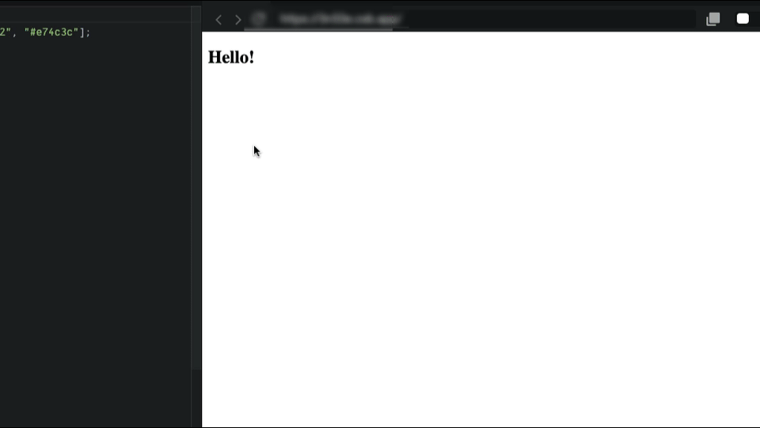

## Languages

## Conditions for Challenges

✅ The text of the title should change when the mouse is on top of it.  
✅ The text of the title should change when the mouse is leaves it.  
✅ When the window is resized the title should change.  
✅ On right click the title should also change.  
✅ The colors of the title should come from a color from the colors array.  
✅ DO NOT CHANGE .css, or .html files.  
✅ ALL function handlers should be INSIDE of "superEventHandler"

## Demo

